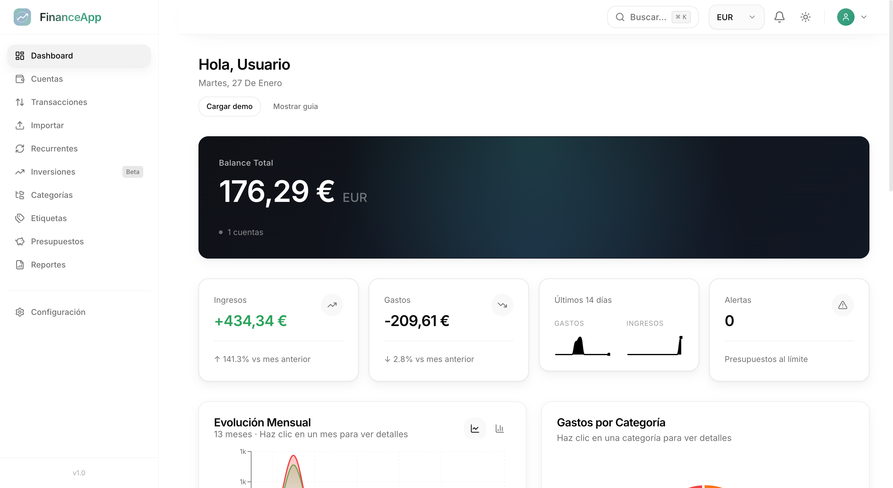
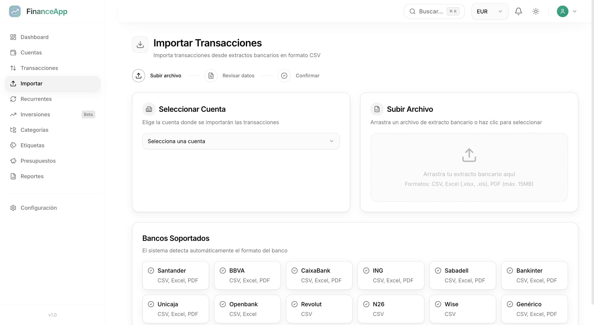
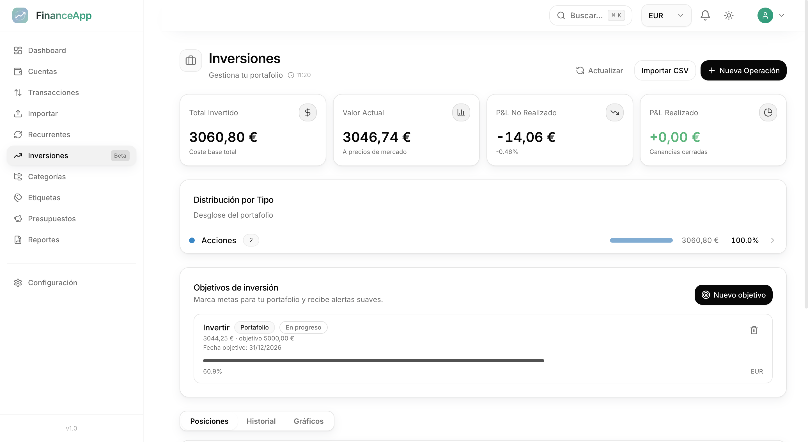

# FinanceApp

App web de finanzas personales para centralizar cuentas, movimientos e inversiones en un solo panel. Pensada para escritorio; el responsive móvil está en progreso.

## Web
- Web: [https://finance-app-web-mu.vercel.app/](https://finance-app-web-mu.vercel.app/)

## Capturas
DASHBOARD


IMPORT


INVESTMENTS


## Funcionalidades
- Cuentas múltiples con multi-moneda.
- Transacciones (ingresos, gastos, transferencias) con filtros y tags.
- Categorías jerárquicas y reglas de auto-categorización.
- Presupuestos con alertas por umbral.
- Importación CSV/Excel/PDF con preview, dedupe y sugerencias.
- Recurrencias con cron y recordatorios.
- Inversiones con holdings, PnL y precios de mercado.
- Dashboard con gráficos y reportes básicos.
- Búsqueda global y atajos de teclado.
- Exportación CSV.

## Decisiones técnicas clave
- Dinero con precisión real: Decimal.js en runtime + NUMERIC en Postgres.
- Ledger append-only: reversals y soft delete para auditar cambios.
- Multi-tenant por `userId` y DTOs validados en API.
- Jobs programados para recurrencias y refresh de tipos de cambio.

## Stack
Backend
- NestJS, Prisma, PostgreSQL, Argon2id, JWT + refresh tokens.

Frontend
- Next.js 14 (App Router), TanStack Query, Zustand, Tailwind, Radix UI.

Infra local
- Docker Compose con Postgres y Redis.

## Arquitectura del repo

```
finances/
├── apps/
│   ├── api/          # Backend NestJS
│   └── web/          # Frontend Next.js
├── docs/
│   ├── adr/          # Architecture Decision Records
└── scripts/          # Scripts de utilidad
```

## Desarrollo local

### Prerrequisitos
- Bun 1.1+
- Docker y Docker Compose

### 1) Instalar
```bash
bun install
```

### 2) Variables de entorno
```bash
cp .env.example .env
```

### 3) Levantar servicios
```bash
docker-compose up -d
```

### 4) Base de datos
```bash
bun run db:generate
bun run db:migrate
bun run db:seed
```

### 5) Iniciar apps
```bash
bun run dev
```

URLs
- Web: http://localhost:3000
- API: http://localhost:3001
- Swagger: http://localhost:3001/api/docs

## Testing
```bash
bun run test
bun run test:cov
```

## Documentación
- ADRs: `docs/adr/ADR-001-orm-selection.md`, `docs/adr/ADR-002-money-handling.md`, `docs/adr/ADR-003-ledger-integrity.md`, `docs/adr/ADR-004-market-price-cache.md`

## Licencia
MIT - Ver `LICENSE`.
